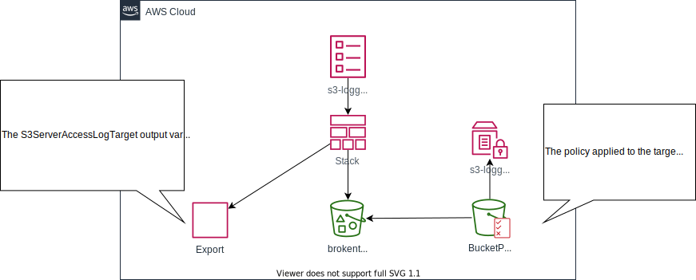
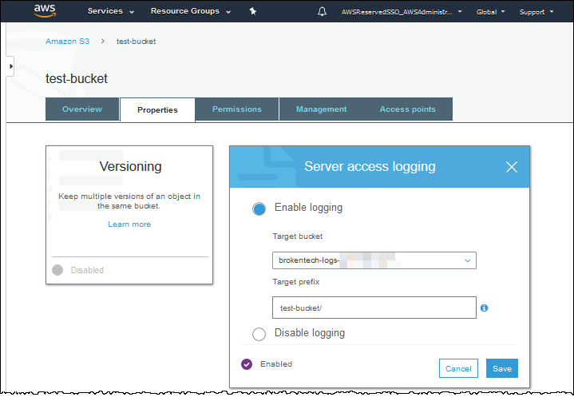

# s3-logging

[](https://github.com/ShahradR/s3-logging/actions?query=workflow%3Apre-commit)

This CloudFormation template creates an S3 bucket to act as a [target for S3 server access logging](https://docs.aws.amazon.com/AmazonS3/latest/dev/ServerLogs.html).

## Architecture

This template accepts `TargetBucketNamePrefix` as a parameter. The provided value will be used as the first part of the bucket name. Because S3 bucket names need to be globally unique, the AWS account ID is appended to the name to ensure uniqueness in multi-account deployments.

The template also references the `s3-logging-iam-role` Systems Manager parameter—the value defines the role used to audit the bucket. The parameter needs to be defined before the stack is created.

Once created, the target bucket name is exported and made available for future CloudFormation templates that create S3 buckets.



## Enable server access logging in S3 buckets

The CloudFormation template exports the `S3ServerAccessLogTarget` output variable. This variable can be referenced in the `LoggingConfiguration` section of the S3 bucket's CloudFormation resource, as shown below.

```yaml
Resources:
  myBucket:
    Type: AWS::S3::Bucket
    Properties:
      BucketName: test-bucket
      LoggingConfiguration:
        DestinationBucketName: !ImportValue S3ServerAccessLogTarget
        LogFilePrefix: test-bucket/
```

### Verifying that server access logging is enabled in the new bucket

To verify that the new resource is using the target bucket for server access logging, log into the AWS Console and navigate to the S3 bucket properties. Server access logging should be enabled and pointing to the target bucket created by this CloudFormation template, as shown in the image below.


